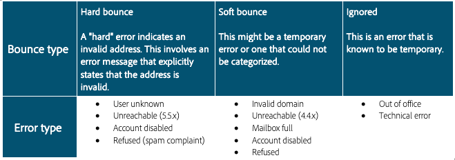

# 其他对交付能力至关重要的指标

识别发送信誉问题的最佳方法之一是通过指标。 让我们看一下一些关键的可交付性指标，以及如何使用它们来识别声誉问题。

## 跳出次数

弹回是投放尝试和失败的结果，ISP提供返回故障通知。 弹跳处理是列表卫生的关键部分。 在给定电子邮件已经连续多次弹回后，此过程会标记它以抑制。 触发抑制所需的跳出次数和类型因系统而异。 此过程会阻止系统继续发送无效的电子邮件地址。 弹回是ISP用来确定IP信誉的关键数据之一。 关注此指标非常重要。 “已送达”与“退回”可能是衡量营销信息投放的最常见方法：交货率越高越好。 我们将探索两种不同的弹回。

## 硬弹回

硬弹回是在ISP确定向用户地址发送邮件的尝试是无法交付的之后，产生的永久故障。 在Adobe Campaign中，分类为不可交付的硬弹回会添加到隔离，这意味着不会重新尝试它们。 有些情况下，如果故障原因不为人所知，硬弹回将被忽略。 以下是一些常见的硬弹跳示例：

* 地址不存在
* 帐户已禁用
* 语法错误
* 坏域

## 软弹回

软弹回是ISP在发送邮件时产生的临时故障。 软失败将重试多次(具有差异，具体取决于使用自定义或现成Adobe Campaign投放设置)，以尝试成功投放。 在尝试最大隔离数之前，不会向重试添加持续软弹回的地址（这也会因设置而异）。 软弹回的一些常见原因包括：

* 邮箱已满
* 向下接收电子邮件服务器
* 发件人信誉问题

>[!NOTE]
>
>弹回是衡量信誉问题的关键指标，因为它们可以突出坏数据源（硬弹回）或ISP的信誉问题（软弹回）。
软弹回通常作为发送电子邮件的一部分发生，在重试处理过程中应允许解决，然后将其描述为真正的可交付性问题。 如果您的软弹跳率高于单个ISP的30%，且在24小时内无法解决，最好向Adobe Campaign交付性顾问提出疑虑。

## 投诉

当用户指示电子邮件是多余的或意外的时候，会注册投诉。 订阅者操作通常在点击垃圾邮件按钮时通过订阅者的电子邮件客户端或第三方垃圾邮件报告系统进行记录。

### ISP投诉

多数第1层和部分第2层ISP为其用户提供垃圾邮件报告方法，因为选择退出和取消订阅过程过去曾被恶意使用来验证电子邮件地址。 Adobe Campaign通过ISP FBL接收这些投诉。 这是在为提供FBL的任何ISP设置过程中建立的，并允许Adobe Campaign自动向隔离表添加投诉的电子邮件地址以进行抑制。 ISP投诉数量激增可能表明列表质量差、列表收集方法不够理想或参与策略不力。 当内容不相关时，也会经常注意到这些内容。

### 第三方投诉

有几个防垃圾邮件组允许在更广的级别报告垃圾邮件。 这些第三方使用的投诉指标用于标记电子邮件内容以识别垃圾电子邮件。 此过程也称为指纹。 这些第三方投诉方法的用户通常对电子邮件更为精通，因此，如果没有得到答复，他们可能会比其他投诉产生更大的影响。

>[!NOTE]
>
>ISP会收集投诉并使用它们确定发送方的整体信誉。 所有投诉都应予以制止，不再按照当地法律法规尽快联系。

## 垃圾邮件陷阱

垃圾邮件陷阱是用于识别未经授权或未经请求的电子邮件的地址。 垃圾邮件陷阱可帮助识别来自欺骗性发件人或未遵循电子邮件最佳实践的邮件。 垃圾邮件陷阱电子邮件地址一般不会公开发布，几乎无法识别。 将电子邮件发送到垃圾邮件陷阱会影响您的声誉，严重程度因陷阱类型和ISP而异。 在以下部分中进一步了解不同类型的垃圾邮件陷阱。

### 回收

回收的垃圾邮件陷阱是过去有效但不再使用的地址。 使列表尽可能清洁的一个关键方法是定期向整个列表发送电子邮件，并适当抑制退回的电子邮件。 这有助于隔离已放弃的电子邮件地址并阻止进一步使用。

在某些情况下，地址可以在30天内循环使用。 定期发送是良好列表卫生的重要方面，也是定期抑制不活跃用户的重要方面。 重新参与活动通常是复杂的电子邮件营销项目的一部分。 此活动样式允许发送方尝试赢回原本不会再通过邮件发送的用户。

### Typo

打字错误垃圾邮件陷阱是包含拼写错误或错误的地址。 这通常发生在主域(例如： [!DNL Gmail][!DNL gmail] 是常见的打字错误)。 ISP和其他阻止列表运营商将注册已知的坏域作为垃圾邮件陷阱，以识别垃圾邮件发送者并衡量发送者的健康状况。 防止典型垃圾邮件陷阱的最佳方法是使用多次选择加入流程进行列表收集。

### 原始

原始垃圾邮件陷阱是没有最终用户且从未有最终用户的地址。 这是一个仅用于识别垃圾电子邮件的地址。 这是影响最大的垃圾邮件陷阱，因为几乎无法识别，需要付出大量努力才能从列表中清除。 大多数黑名单会利用原汁原味的垃圾邮件陷阱来列表信誉不佳的发件人。 避免原汁原味的垃圾邮件陷阱感染更广泛的营销电子邮件列表的唯一方法是利用多次选择加入流程进行列表收集。

## 牛

Bulking是指将邮件投放到ISP的垃圾邮件或垃圾邮件文件夹中。 当低于正常的打开率（有时还有点击率）与高交付率配对时，可以识别该信息。 电子邮件数量激增的原因因ISP而异。 但是，通常，如果邮件放在批量文件夹中，则影响发送信誉的标志(例如列表卫生)需要重新评估。 这是一个信号，表明声誉正在下降，这是一个需要立即纠正的问题，才会影响到更多活动。 与Adobe Campaign交付能力顾问合作，根据您的情况解决任何膨胀问题。

## 阻止

当垃圾邮件指示符达到专有ISP的阈值且ISP开始阻止来自发送方的邮件（通过弹回邮寄尝试而显着）时，会发生阻塞。 有各种类型的块。 通常，块会出现特定于IP地址的情况，但也可能出现在发送域或实体级别。 解决Adobe Campaign块需要具体的专业知识，因此请与您的客户交付能力顾问联系以获取帮助。

## 黑名单

当第三方黑名单管理者注册与发送者关联的垃圾邮件发送者类似的行为时，就会发生黑名单。 黑名单的原因有时会由黑名单方公布。 列表通常基于IP地址，但在更严重的情况下，列表可以按IP范围，甚至是发送域。 解决黑名单时应包括Adobe Campaign交付性顾问的支持，以便完全解决并防止进一步列出。 一些上市非常严重，可能导致难以解决的长期声誉问题。 黑名单的结果因黑名单而异，但可能会影响所有电子邮件的投放。

## 其他资源

* [投放失败类型和原因](https://docs.adobe.com/content/help/en/campaign-standard/using/testing-and-sending/monitoring-messages/understanding-delivery-failures.html#delivery-failure-types-and-reasons)
