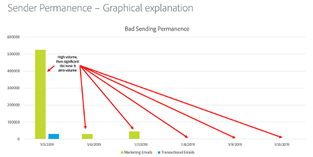

# 发件人永久性

发送持久性是建立一致的发送量和策略以维护ISP信誉的过程。 以下是发送方永久性重要的原因：

* 垃圾邮件发送者通常会“IP地址跳转”，这意味着他们会不断地在许多IP地址之间转移流量，以避免出现信誉问题。
* 一致性是向ISP证明发送方信誉良好且不会试图绕过任何由于发送方式不佳而导致的声誉问题的关键。
* 在某些ISP甚至会认为发送方信誉良好之前，需要长时间保持这些一致的策略。

**以下是一些示例：**

