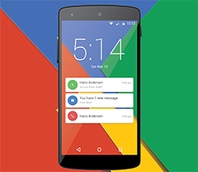

# 概述

Adobe Campaign 提供了跨渠道客户体验设计平台，并为可视化的活动编排、实时互动管理和跨渠道执行提供了环境。本用户指南包含有关 Adobe Campaign Standard 众多特性和功能的视频和教程。

## 新增内容

* **[GPG 密钥管理](/help/administrating/control-panel/gpg-key-management/gpg-key-management-overview.md)**

   *了解如何在指定的 Campaign 实例上生成和安装公钥/私钥对以加密出站数据，以及在 Campaign 实例上导入和安装公钥以解密入站数据。*

* **[外部 API 活动](/help/managing-processes-and-data/data-management-activities/external-api-activity.md)**

   *了解如何使用外部 API 活动配置和运行工作流。*

## 员工挑选

<table>
<tr>
  <td>
    
    

      <a href="./communication-channels/email/profile-substitution.md">
    <strong>用户档案替换 - 使用目标用户档案测试电子邮件（视频）</strong>
    </a>
    

    

    <em>了解如何发送验证以供审阅，其中包含用户档案将收到的消息的确切呈现形式。</em>
    

  </td>
   <td>
    
    

      <a href="./designing-content/email-designer/email-designer-overview.md">
    <strong>电子邮件设计工具（视频）</strong>
    </a>
    

    

    <em>电子邮件设计工具能够快速、轻松地创建个性化电子邮件的视觉效果。</em>
    

  </td>
  <td>
    
    

      <a href="https://docs.adobe.com/content/help/zh-Hans/campaign-standard-learn/getting-started-with-push-notifications-android/introduction.html">
    <strong>教程：Android 推送通知入门</strong>
    </a>
    

    

    <em>本教程将指导您完成从 Adobe Campaign 发送推送通知以及在 Android 应用程序中接收这些通知所涉及的步骤。 </em>
    

  </td>
</tr>
</table>

## 其他资源

* [文档](https://docs.adobe.com/content/help/zh-Hans/campaign-standard/using/campaign-standard-home.html)
