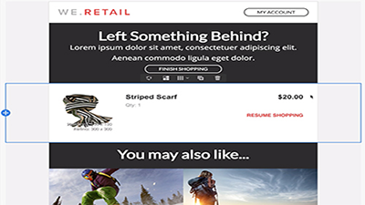

# 概述

Adobe Campaign 提供了跨渠道客户体验设计平台，并为可视化的活动编排、实时互动管理和跨渠道执行提供了环境。本用户指南包含有关Adobe Campaign标准版的许多特性和功能的视频和教程。

## 新增内容

* **[外部API活动](/help/managing-processes-and-data/data-management-activities/external-api-activity.md)**    
   *了解如何使用外部API活动配置和运行工作流。*

* **[用户档案替换——使用目标用户档案测试电子邮件](/help/communication-channels/email/profile-substitution.md)**    
   *了解如何发送验证以供审阅，其中用户档案将收到的消息具有确切的表示形式。*

* **[控制面板- Google TXT记录管理](/help/administrating/control-panel/google-txt-record-management.md)**    
   *了解如何将Google TXT站点验证记录添加到所有子域，这些子域用于通过活动控制面板向GMAIL地址发送电子邮件。*

* **[教程： Android推送通知入门](https://docs.adobe.com/content/help/en/campaign-standard-learn/getting-started-with-push-notifications-android/introduction.html)**    
   *本教程将指导您完成从Adobe Campaign发送推送通知以及在Android应用程序中接收这些通知所涉及的步骤。*

## 员工挑选

<table>
<tr>
  <td>
    
    

      <a href="./communication-channels/mobile/in-app/in-app-message-overview.md">
    <strong>应用程序内消息传递（教程）</strong>
    </a>
    

    

    <em>应用程序内消息传递是一种渠道，当用户在移动应用程序中处于活动状态时，它允许您显示消息。</em>
    

  </td>
   <td>
    
    

      <a href="./designing-content/email-designer/email-designer-overview.md">
    <strong>电子邮件设计人员（视频）</strong>
    </a>
    

    

    <em>电子邮件设计器能够快速、轻松地创建个性化电子邮件的视觉效果。</em>
    

  </td>
  <td>
    
    

      <a href="./designing-content/product-listings-in-transactional-email.md">
    <strong>产品列表（教程）</strong>
    </a>
    

    

    <em>利用一列表产品和产品创建交易电子邮件。 </em>
    

  </td>
</tr>
</table>

## 其他资源

* [文档](https://docs.adobe.com/content/help/en/campaign-standard/using/campaign-standard-home.html)
