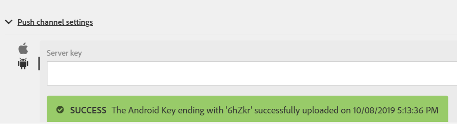

# 步骤1 —— 创建[!DNL Android]应用程序并配置为使用[!DNL Firebase Cloud Messaging]

在此部分，您将创建[!DNL Android]应用程序以接收从Adobe Campaign Standard发送的[!UICONTROL Push notifications]。 要接收推送通知，需要向Google的[!DNL Firebase Cloud Service]注册应用程序。

1. 登录您的[!DNL Firebase]帐户。

   [!DNL Firebase] 是Google的移动平台，可帮助您快速开发高质量应用。如果您没有[!DNL Firebase]帐户，请从此处创建一个[。](https://firebase.google.com)

2. 启动[!DNL Android Studio]
3. 单击&#x200B;**[!UICONTROL File]** > **[!UICONTROL New]** > **[!UICONTROL New Project]。**
4. 选择 **[!UICONTROL Empty Activity]** 并单击 **[!UICONTROL Next]。**

   

5. 为项目提供有意义的名称。

   为了演示，我们已将项目命名为&#x200B;*[!DNL ACSPushTutorial]*

   

6. 接受默认包名称，然后单击&#x200B;**[!DNL Finish]**&#x200B;以创建项目。
7. 您的项目结构应类似于下面的屏幕快照

   

8. 单击 **[!UICONTROL Tools]** > **[!UICONTROL Firebase].** (这会将项目添加到 [!DNL Firebase])
9. 单击 **[!UICONTROL Set up Firebase Cloud Messaging].**

   

10. 单击 **[!UICONTROL Connect to Firebase].**
11. 将应用程序连接到Firebase后，单击&#x200B;**[!UICONTROL Add FCM to your app]。**
12. 单击 **[!UICONTROL Accept Changes].**

   将FCM添加到应用程序时，向导需要您的权限才能对项目进行一些更改。

   ![[!DNL add-fcm-to-your-app]](assets/firebase-add-fcm-to-app.PNG)

成功将应用程序与Firebase集成后，您应会收到如下消息：

![[!DNL fcm-successfull]](assets/android-firebase-success.PNG)

[确保在控制台中列出您的 [!DNL Firebase ]项目](https://console.firebase.google.com/)

## 配置[!UICONTROL Push Channel]设置

1. 登录[!DNL Firebase]控制台
2. 打开&#x200B;**[!UICONTROL ACSPushTutorial]**&#x200B;项目。
3. 单击&#x200B;**齿轮图标**&#x200B;并打开项目设置

   

4. Tab键，指向&#x200B;**[!UICONTROL Cloud Messaging]**&#x200B;选项卡。
5. 复制服务器密钥

   

6. 登录您的Adobe Campaign Standard实例
7. 单击&#x200B;**[!UICONTROL Adobe Campaign]** > **[!UICONTROL Administration]** > **[!UICONTROL Channels]** > **[!UICONTROL Mobile App]。**
8. 选择相应的&#x200B;**[!UICONTROL Mobile Application Property]。**
9. 单击&#x200B;**[!UICONTROL Push Channel settings]**&#x200B;部分中的&#x200B;**[!DNL Android]图标**。
10. 将服务器密钥粘贴到服务器密钥字段中。

如果一切顺利，您应看到一条SUCCESS消息。

总之，我们创建了[!DNL Android App]并将[!DNL Android App]与[!DNL Firebase]连接。 然后，我们将[!DNL Android]应用程序的服务器密钥粘贴到Adobe Campaign Standard的移动应用程序中，将&lt;a1/>应用程序与[!DNL Android App]Adobe Campaign连接。
