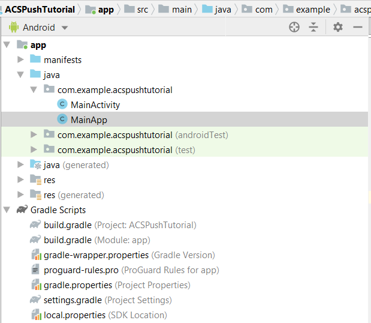

# 步骤2 — 将[!UICONTROL Mobile SDK]与Android应用程序集成

在此部分中，我们将将[!DNL Android]应用与[!UICONTROL Mobile SDK]集成。 要将[!UICONTROL mobile SDK]与[!DNL Android]应用程序集成，请执行以下步骤：

* 在[!DNL Android Studio]中打开&#x200B;*ACSPushTutorial*&#x200B;项目
* 创建一个名为&#x200B;*MainApp*&#x200B;的新Java类，该类扩展[!DNL android.app.Application]
* 此时，您的项目结构应如下所示



* 展开[!DNL Gradle Scripts]文件夹。 双击模块的[!DNL build.gradle]。 将以下依赖项粘贴到[!DNL build.gradle]文件的依赖项部分中。 您的[!DNL build.gradle]文件现在应如下所示

<!--
Removed `{.line-numbers}` below
-->

```java
implementation 'com.adobe.marketing.mobile:campaign:1.+'
implementation 'com.adobe.marketing.mobile:userprofile:1.+'
implementation 'com.adobe.marketing.mobile:sdk-core:1.+'
```


* 通过单击“立即同步”按钮同步您的[!DNL Android]项目，以同步您的项目

## 修改[!DNL AndroidManifest.xml]{#modify-android-manifest}

打开&#x200B;*AndroidManifest.xml*&#x200B;并将以下2行粘贴到清单元素之后、应用程序元素之前。 这使您的应用程序能够与外部世界通信

<!--
Removed `{.line-numbers}` below
-->

```xml
<uses-permission android:name="android.permission.INTERNET" />
<uses-permission android:name="android.permission.ACCESS_NETWORK_STATE" />
```

复制应用程序元素中的以下行
[!DNL android:name=&quot;。MainApp&quot;]
保存您的 [!DNL AndroidManifest.xml]
您的[!DNL AndroidManifest.xml]应如下所示

<!--
Removed `{.line-numbers}` below
-->

```xml
<?xml version="1.0" encoding="utf-8"?>
<manifest xmlns:android="http://schemas.android.com/apk/res/android"
    package="com.example.acspushtutorial">
    <uses-permission android:name="android.permission.INTERNET" />
    <uses-permission android:name="android.permission.ACCESS_NETWORK_STATE" />

<application
    android:name=".MainApp"
    android:allowBackup="true"
    android:icon="@mipmap/ic_launcher"
    android:label="@string/app_name"
    android:roundIcon="@mipmap/ic_launcher_round"
    android:supportsRtl="true"
    android:theme="@style/AppTheme">

<activity android:name=".MainActivity">
<intent-filter>
    <action android:name="android.intent.action.MAIN" />
    <category android:name="android.intent.category.LAUNCHER" />
</intent-filter>
</activity>
</application>

</manifest>
```
