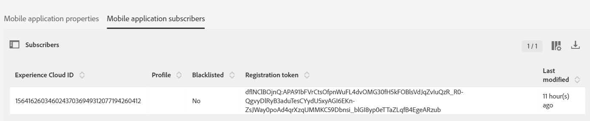

# 步骤4 — 设置 [!DNL pushidentifier]

此 **[!DNL pushidentifier]** 是一个字符串，其中包含的设备令牌 [!DNL Push] 通知。 它是由发送的同一令牌 [!DNL Firebase] 并使用传递到SDK [!DNL MobileCore.setPushIdentifier] 方法。

在中打开您的项目 [!DNL Android™ ]工作室。 删除中的整个代码 [!DNL MainActivity] **除了第一行，即您的包语句**.

将以下代码粘贴到 [!DNL MainActivity]：

<!--
Removed `{.line-numbers}` below
-->

```java
import androidx.annotation.NonNull;
import androidx.appcompat.app.AppCompatActivity;

import android.os.Bundle;
import android.util.Log;
import android.widget.Toast;

import com.adobe.marketing.mobile.MobileCore;
import com.google.android.gms.tasks.OnCompleteListener;
import com.google.android.gms.tasks.Task;
import com.google.firebase.iid.FirebaseInstanceId;
import com.google.firebase.iid.InstanceIdResult;

public class MainActivity extends AppCompatActivity {

@Override
protected void onCreate(Bundle savedInstanceState) {
super.onCreate(savedInstanceState);
setContentView(R.layout.activity_main);

registerToken();
}

void registerToken() {
FirebaseInstanceId.getInstance().getInstanceId()
    .addOnCompleteListener(new OnCompleteListener<InstanceIdResult>() {
        @Override
        public void onComplete(@NonNull Task<InstanceIdResult> task) {
            if (!task.isSuccessful()) {
                Log.w("Message App", "getInstanceId failed", task.getException());
                return;
            }

// Get new Instance ID token
String token = task.getResult().getToken();

Log.d("Got token", token);

MobileCore.setPushIdentifier(token);
}
});
}

@Override
public void onResume() {
super.onResume();
MobileCore.setApplication(getApplication());
MobileCore.lifecycleStart(null);
}

@Override
public void onPause() {
super.onPause();
MobileCore.lifecyclePause();
}
}
```

## 测试您的应用程序

现在，是测试您的应用程序的良好时机，然后再继续下一步操作。

* 单击绿色箭头或选择以运行应用程序 **[!DNL Run->Run'app']**.
* 此 [!DNL Android™] 模拟器应已启动，您应会看到应用程序正在与一起运行 [!DNL "Hello World" ]文本。
* 打开 [!DNL logcat] 窗口。 搜索“”[!DNL Got]“。 您应该会看到从收到的令牌 [!DNL Firebase] 写入日志中，如下所示。 “”之后的长字符串[!DNL Got token]”是 [!DNL pushidentifier ]发送到Adobe Campaign的内容。


### 检查移动应用程序订阅者

登录到您的Adobe Campaign Standard实例。
导航 **[!UICONTROL Administration->Channels->Mobile App(Experience Platform SDK)]**. 打开相应的移动设备应用程序。 按Tab键转到 [!UICONTROL Mobile Application Subscribers] 选项卡。 您应会看到 [!UICONTROL registration token ]已列出。



>[!NOTE]
>
>如果您在中看不到注册令牌 [!UICONTROL Mobile Application Subscribers] 按STOP键，然后再继续。
